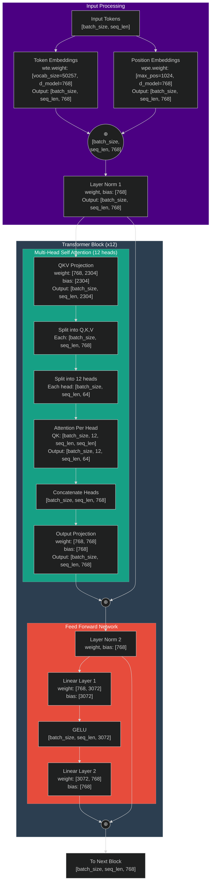

```mermaid
%%{init: {'theme': 'dark'}}%%
flowchart TD
    subgraph InputProcessing["Input Processing"]
        Input["Input Tokens<br>[batch_size, seq_len]"] --> WTE["Token Embeddings<br>wte.weight: [vocab_size=50257, d_model=768]<br>Output: [batch_size, seq_len, 768]"]
        Input --> WPE["Position Embeddings<br>wpe.weight: [max_pos=1024, d_model=768]<br>Output: [batch_size, seq_len, 768]"]
        WTE --> Sum(("⊕<br>[batch_size,<br>seq_len, 768]"))
        WPE --> Sum
        Sum --> FirstLN["Layer Norm 1<br>weight, bias: [768]<br>Output: [batch_size, seq_len, 768]"]
    end

    subgraph TransformerBlock["Transformer Block (x12)"]
        FirstLN --> QKV["QKV Projection<br>weight: [768, 2304]<br>bias: [2304]<br>Output: [batch_size, seq_len, 2304]"]
        
        subgraph MultiHeadAttention["Multi-Head Self Attention (12 heads)"]
            QKV --> Split["Split into Q,K,V<br>Each: [batch_size, seq_len, 768]"]
            Split --> HeadSplit["Split into 12 heads<br>Each head: [batch_size, seq_len, 64]"]
            HeadSplit --> ATT["Attention Per Head<br>QK: [batch_size, 12, seq_len, seq_len]<br>Output: [batch_size, 12, seq_len, 64]"]
            ATT --> Concat["Concatenate Heads<br>[batch_size, seq_len, 768]"]
            Concat --> AttProj["Output Projection<br>weight: [768, 768]<br>bias: [768]<br>Output: [batch_size, seq_len, 768]"]
        end
        
        AttProj --> Add1(("⊕"))
        FirstLN --> Add1
        Add1 --> SecondLN["Layer Norm 2<br>weight, bias: [768]"]
        
        subgraph FFN["Feed Forward Network"]
            SecondLN --> FC1["Linear Layer 1<br>weight: [768, 3072]<br>bias: [3072]"]
            FC1 --> GELU["GELU<br>[batch_size, seq_len, 3072]"]
            GELU --> FC2["Linear Layer 2<br>weight: [3072, 768]<br>bias: [768]"]
        end
        
        FC2 --> Add2(("⊕"))
        SecondLN --> Add2
    end

    Add2 --> NextBlock["To Next Block<br>[batch_size, seq_len, 768]"]

    style InputProcessing fill:#4B0082,color:#fff
    style TransformerBlock fill:#2C3E50,color:#fff
    style MultiHeadAttention fill:#16A085,color:#fff
    style FFN fill:#E74C3C,color:#fff
```