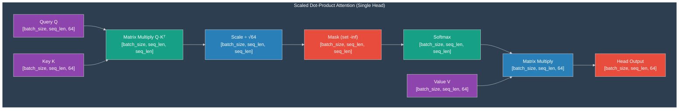

```mermaid
%%{init: {'theme': 'dark'}}%%
flowchart TD
    subgraph ScaledDotProductAttention["Scaled Dot-Product Attention (Single Head)"]
        Q["Query Q<br>[batch_size, seq_len, 64]"] & K["Key K<br>[batch_size, seq_len, 64]"] --> MatMul1["Matrix Multiply Q·Kᵀ<br>[batch_size, seq_len, seq_len]"]
        MatMul1 --> Scale["Scale ÷ √64<br>[batch_size, seq_len, seq_len]"]
        Scale --> Mask["Mask (set -inf)<br>[batch_size, seq_len, seq_len]"]
        Mask --> Softmax["Softmax<br>[batch_size, seq_len, seq_len]"]
        Softmax & V["Value V<br>[batch_size, seq_len, 64]"] --> MatMul2["Matrix Multiply<br>[batch_size, seq_len, 64]"]
        MatMul2 --> Output["Head Output<br>[batch_size, seq_len, 64]"]
    end

    style ScaledDotProductAttention fill:#2C3E50,color:#fff
    style Q fill:#8E44AD,color:#fff
    style K fill:#8E44AD,color:#fff
    style V fill:#8E44AD,color:#fff
    style MatMul1 fill:#16A085,color:#fff
    style Scale fill:#2980B9,color:#fff
    style Mask fill:#E74C3C,color:#fff
    style Softmax fill:#16A085,color:#fff
    style MatMul2 fill:#2980B9,color:#fff
    style Output fill:#E74C3C,color:#fff
```