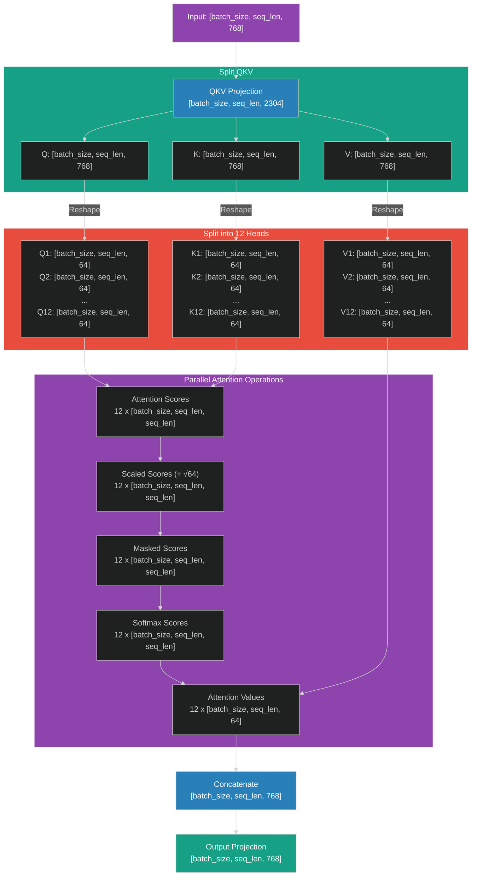

```mermaid
%%{init: {'theme': 'dark'}}%%
flowchart TD
    Input["Input: [batch_size, seq_len, 768]"] --> QKV["QKV Projection<br>[batch_size, seq_len, 2304]"]
    
    subgraph SplitQKV["Split QKV"]
        QKV --> Q["Q: [batch_size, seq_len, 768]"]
        QKV --> K["K: [batch_size, seq_len, 768]"]
        QKV --> V["V: [batch_size, seq_len, 768]"]
    end

    subgraph HeadSplit["Split into 12 Heads"]
        Q --> |"Reshape"| QHeads["Q1: [batch_size, seq_len, 64]<br>Q2: [batch_size, seq_len, 64]<br>...<br>Q12: [batch_size, seq_len, 64]"]
        K --> |"Reshape"| KHeads["K1: [batch_size, seq_len, 64]<br>K2: [batch_size, seq_len, 64]<br>...<br>K12: [batch_size, seq_len, 64]"]
        V --> |"Reshape"| VHeads["V1: [batch_size, seq_len, 64]<br>V2: [batch_size, seq_len, 64]<br>...<br>V12: [batch_size, seq_len, 64]"]
    end

    subgraph AttentionOps["Parallel Attention Operations"]
        QHeads & KHeads --> Scores["Attention Scores<br>12 x [batch_size, seq_len, seq_len]"]
        Scores --> ScaledScores["Scaled Scores (÷ √64)<br>12 x [batch_size, seq_len, seq_len]"]
        ScaledScores --> MaskedScores["Masked Scores<br>12 x [batch_size, seq_len, seq_len]"]
        MaskedScores --> SoftmaxScores["Softmax Scores<br>12 x [batch_size, seq_len, seq_len]"]
        SoftmaxScores & VHeads --> AttValues["Attention Values<br>12 x [batch_size, seq_len, 64]"]
    end

    AttValues --> Concat["Concatenate<br>[batch_size, seq_len, 768]"]
    Concat --> OutProj["Output Projection<br>[batch_size, seq_len, 768]"]

    style Input fill:#8E44AD,color:#fff
    style QKV fill:#2980B9,color:#fff
    style SplitQKV fill:#16A085,color:#fff
    style HeadSplit fill:#E74C3C,color:#fff
    style AttentionOps fill:#8E44AD,color:#fff
    style Concat fill:#2980B9,color:#fff
    style OutProj fill:#16A085,color:#fff
```