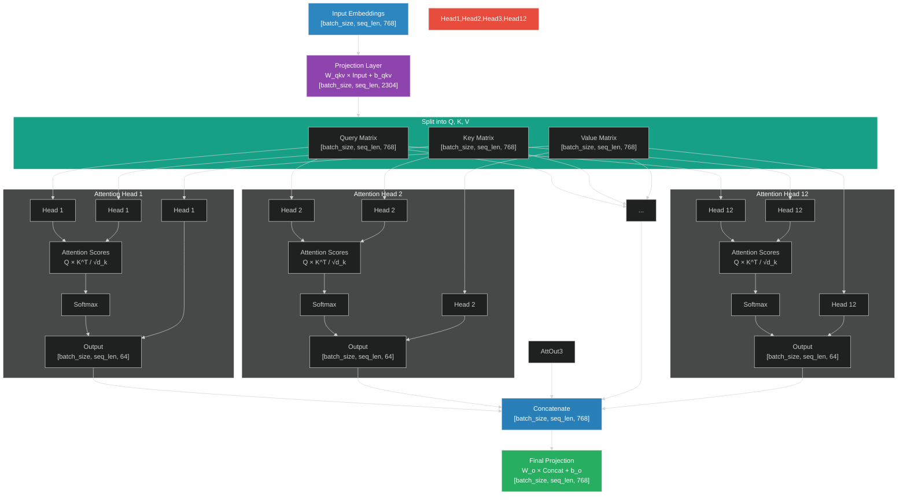

```mermaid
%%{init: {'theme': 'dark'}}%%
flowchart TD
    Input["Input Embeddings
    [batch_size, seq_len, 768]"] --> ProjectionLayer

    ProjectionLayer["Projection Layer
    W_qkv × Input + b_qkv
    [batch_size, seq_len, 2304]"] --> QKVSplit

    subgraph QKVSplit["Split into Q, K, V"]
        Q["Query Matrix
        [batch_size, seq_len, 768]"]
        K["Key Matrix
        [batch_size, seq_len, 768]"]
        V["Value Matrix
        [batch_size, seq_len, 768]"]
    end

    Q --> Head1Q["Head 1"]
    K --> Head1K["Head 1"]
    V --> Head1V["Head 1"]
    
    Q --> Head2Q["Head 2"]
    K --> Head2K["Head 2"]
    V --> Head2V["Head 2"]

    
    Q --> Dots["..."]
    K --> Dots
    V --> Dots
    
    Q --> Head12Q["Head 12"]
    K --> Head12K["Head 12"]
    V --> Head12V["Head 12"]

    subgraph Head1["Attention Head 1"]
        Head1Q & Head1K --> Score1["Attention Scores
        Q × K^T / √d_k"]
        Score1 --> Softmax1["Softmax"]
        Softmax1 & Head1V --> AttOut1["Output
        [batch_size, seq_len, 64]"]
    end

    subgraph Head2["Attention Head 2"]
        Head2Q & Head2K --> Score2["Attention Scores
        Q × K^T / √d_k"]
        Score2 --> Softmax2["Softmax"]
        Softmax2 & Head2V --> AttOut2["Output
        [batch_size, seq_len, 64]"]
    end

    subgraph Head12["Attention Head 12"]
        Head12Q & Head12K --> Score12["Attention Scores
        Q × K^T / √d_k"]
        Score12 --> Softmax12["Softmax"]
        Softmax12 & Head12V --> AttOut12["Output
        [batch_size, seq_len, 64]"]
    end

    AttOut1 & AttOut2 & AttOut3 & Dots & AttOut12 --> Concat["Concatenate
    [batch_size, seq_len, 768]"]
    
    Concat --> FinalProj["Final Projection
    W_o × Concat + b_o
    [batch_size, seq_len, 768]"]

    style Input fill:#2E86C1,color:#fff
    style ProjectionLayer fill:#8E44AD,color:#fff
    style QKVSplit fill:#16A085,color:#fff
    style Head1,Head2,Head3,Head12 fill:#E74C3C,color:#fff
    style Concat fill:#2980B9,color:#fff
    style FinalProj fill:#27AE60,color:#fff
```