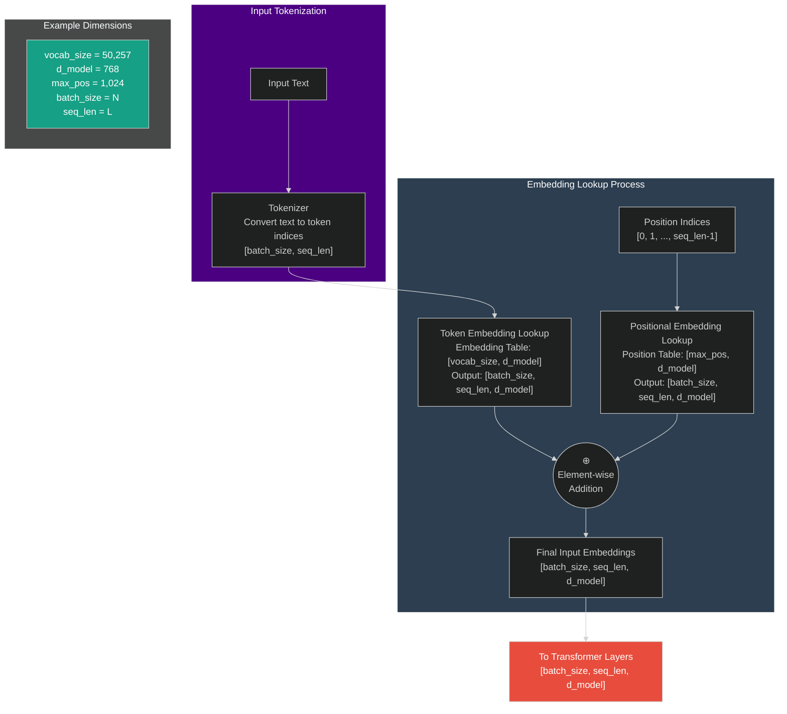

```mermaid
%%{init: {'theme': 'dark'}}%%
flowchart TD
    subgraph InputTokenization["Input Tokenization"]
        Input["Input Text"] --> Tokenizer["Tokenizer<br>Convert text to token indices<br>[batch_size, seq_len]"]
        style InputTokenization fill:#4B0082,color:#fff
    end

    subgraph EmbeddingLookup["Embedding Lookup Process"]
        Tokenizer --> TokenEmbed["Token Embedding Lookup<br>Embedding Table: [vocab_size, d_model]<br>Output: [batch_size, seq_len, d_model]"]
        
        Position["Position Indices<br>[0, 1, ..., seq_len-1]"] --> PosEmbed["Positional Embedding Lookup<br>Position Table: [max_pos, d_model]<br>Output: [batch_size, seq_len, d_model]"]
        
        TokenEmbed --> Addition(("⊕<br>Element-wise<br>Addition"))
        PosEmbed --> Addition
        
        Addition --> FinalEmbed["Final Input Embeddings<br>[batch_size, seq_len, d_model]"]
        
        style EmbeddingLookup fill:#2C3E50,color:#fff
    end

    subgraph Example["Example Dimensions"]
        dim1["vocab_size = 50,257<br>d_model = 768<br>max_pos = 1,024<br>batch_size = N<br>seq_len = L"]
        style dim1 fill:#16A085,color:#fff
    end

    FinalEmbed --> ToTransformer["To Transformer Layers<br>[batch_size, seq_len, d_model]"]

    style ToTransformer fill:#E74C3C,color:#fff
```