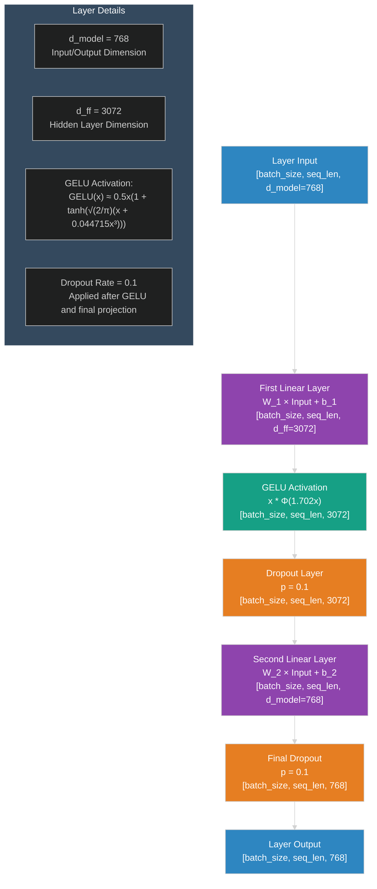

```mermaid
%%{init: {'theme': 'dark'}}%%
flowchart TD
    Input["Layer Input
    [batch_size, seq_len, d_model=768]"] --> LinearProj1

    LinearProj1["First Linear Layer
    W_1 × Input + b_1
    [batch_size, seq_len, d_ff=3072]"] --> GELU

    GELU["GELU Activation
    x * Φ(1.702x)
    [batch_size, seq_len, 3072]"] --> Dropout1

    Dropout1["Dropout Layer
    p = 0.1
    [batch_size, seq_len, 3072]"] --> LinearProj2

    LinearProj2["Second Linear Layer
    W_2 × Input + b_2
    [batch_size, seq_len, d_model=768]"] --> Dropout2

    Dropout2["Final Dropout
    p = 0.1
    [batch_size, seq_len, 768]"] --> Output

    Output["Layer Output
    [batch_size, seq_len, 768]"]

    subgraph Details["Layer Details"]
        direction LR
        D1["d_model = 768
        Input/Output Dimension"]
        D2["d_ff = 3072
        Hidden Layer Dimension"]
        D3["GELU Activation:
        GELU(x) ≈ 0.5x(1 + tanh(√(2/π)(x + 0.044715x³)))"]
        D4["Dropout Rate = 0.1
        Applied after GELU and final projection"]
    end

    style Input fill:#2E86C1,color:#fff
    style LinearProj1 fill:#8E44AD,color:#fff
    style GELU fill:#16A085,color:#fff
    style Dropout1 fill:#E67E22,color:#fff
    style LinearProj2 fill:#8E44AD,color:#fff
    style Dropout2 fill:#E67E22,color:#fff
    style Output fill:#2E86C1,color:#fff
    style Details fill:#34495E,color:#fff
```