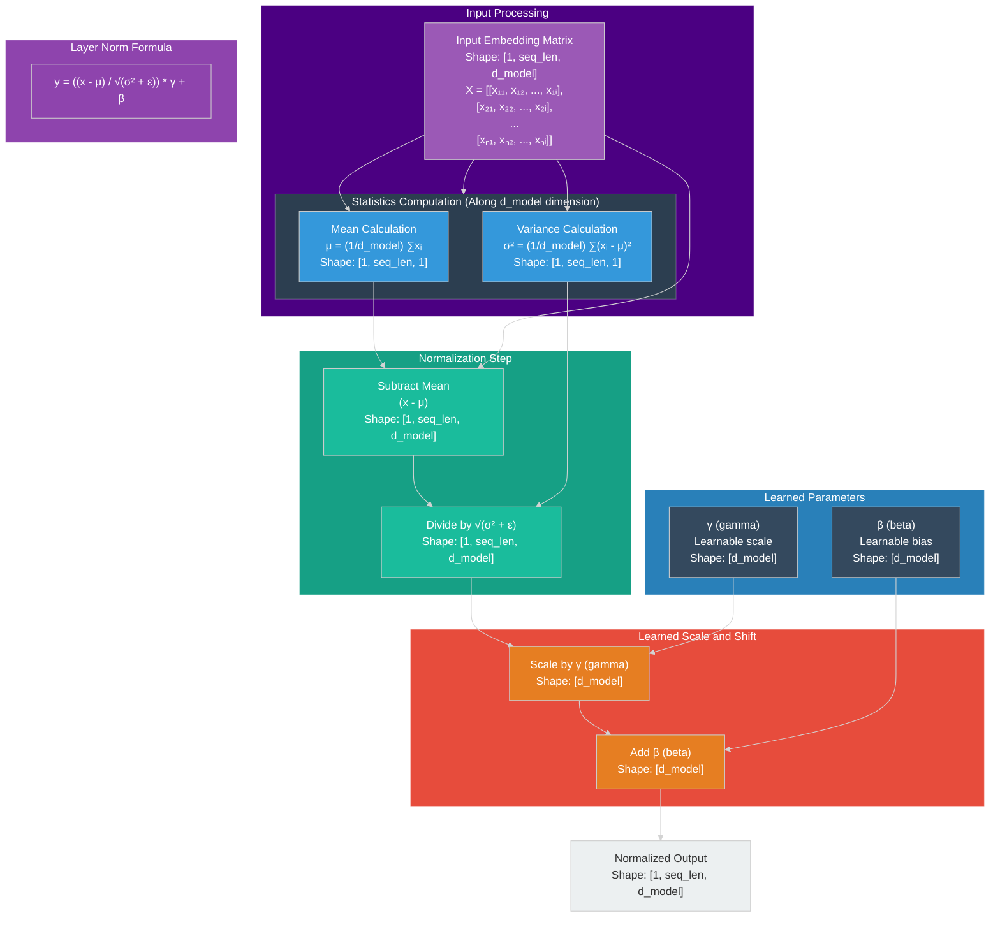

```mermaid

%%{init: {'theme': 'dark'}}%%
flowchart TD
    subgraph Input["Input Processing"]
        X["Input Embedding Matrix<br>Shape: [1, seq_len, d_model]<br>X = [[x₁₁, x₁₂, ..., x₁ᵢ],<br>[x₂₁, x₂₂, ..., x₂ᵢ],<br>...<br>[xₙ₁, xₙ₂, ..., xₙᵢ]]"] --> ParallelComp
    end

    subgraph ParallelComp["Statistics Computation (Along d_model dimension)"]
        X --> MeanCalc["Mean Calculation<br>μ = (1/d_model) ∑xᵢ<br>Shape: [1, seq_len, 1]"]
        X --> VarCalc["Variance Calculation<br>σ² = (1/d_model) ∑(xᵢ - μ)²<br>Shape: [1, seq_len, 1]"]
    end

    subgraph Normalization["Normalization Step"]
        MeanCalc --> SubMean["Subtract Mean<br>(x - μ)<br>Shape: [1, seq_len, d_model]"]
        X --> SubMean
        
        SubMean --> DivStd["Divide by √(σ² + ε)<br>Shape: [1, seq_len, d_model]"]
        VarCalc --> DivStd
    end

    subgraph Scaling["Learned Scale and Shift"]
        DivStd --> ScaleGamma["Scale by γ (gamma)<br>Shape: [d_model]"]
        ScaleGamma --> AddBeta["Add β (beta)<br>Shape: [d_model]"]
    end

    AddBeta --> Output["Normalized Output<br>Shape: [1, seq_len, d_model]"]

    subgraph Formula["Layer Norm Formula"]
        Eq["y = ((x - μ) / √(σ² + ε)) * γ + β"]
    end

    subgraph LearnedParams["Learned Parameters"]
        Gamma["γ (gamma)<br>Learnable scale<br>Shape: [d_model]"]
        Beta["β (beta)<br>Learnable bias<br>Shape: [d_model]"]
    end

    Gamma --> ScaleGamma
    Beta --> AddBeta

    style Input fill:#4B0082,color:#fff
    style ParallelComp fill:#2C3E50,color:#fff
    style Normalization fill:#16A085,color:#fff
    style Scaling fill:#E74C3C,color:#fff
    style Formula fill:#8E44AD,color:#fff
    style LearnedParams fill:#2980B9,color:#fff
    
    style X fill:#9B59B6,color:#fff
    style MeanCalc fill:#3498DB,color:#fff
    style VarCalc fill:#3498DB,color:#fff
    style SubMean fill:#1ABC9C,color:#fff
    style DivStd fill:#1ABC9C,color:#fff
    style ScaleGamma fill:#E67E22,color:#fff
    style AddBeta fill:#E67E22,color:#fff
    style Output fill:#ECF0F1,color:#333
    style Gamma fill:#34495E,color:#fff
    style Beta fill:#34495E,color:#fff
    style Eq fill:#8E44AD,color:#fff

```